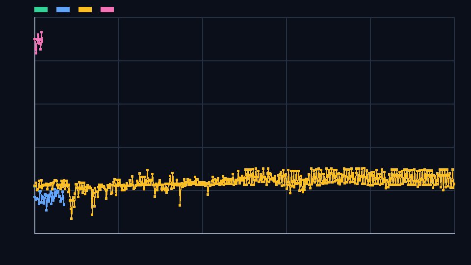
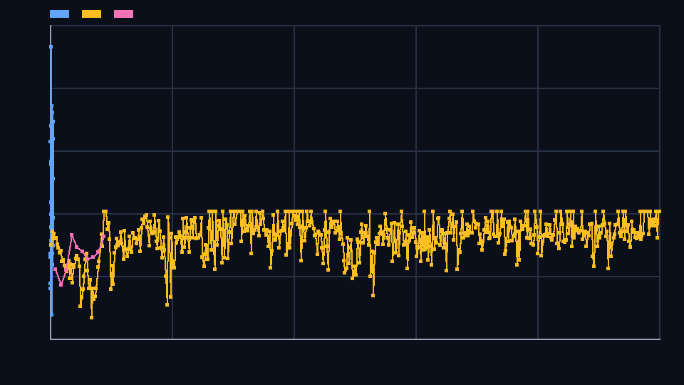

# Agent Valley

Agent Valley is a multi-agent resource-management environment. It supports
real backend RL training through tabular Q-learning, a small neural policy, and
compact GRPO-style grouped reward optimization. The frontend displays backend
JSONL metrics from real environment rollouts. The animated valley is a separate
visual simulation and is clearly labeled as such.

## Theme #1 Alignment

Primary hackathon theme: **Theme #1: Multi-Agent Interactions**.

Agent Valley targets cooperation, competition, shared resources, risk posture,
and coalition/team survival under partial observability. Four specialized
agents act at the same tick:

| Agent | Role | Home region | Preferred action |
| --- | --- | --- | --- |
| farmer | Food producer | farmland | gather food and share |
| miner | Resource extractor | mine | gather ore and coordinate |
| builder | Infrastructure | village | build with stone and coordinate |
| warrior | Defense | wilderness | defend and protect |

`env.multi_agent_env.MultiAgentValleyEnv` gives each agent a partial
observation, accepts simultaneous actions, picks a lead action for the inner
OpenEnv benchmark, and returns per-agent rewards with role, cooperation,
conflict, and base environment components.

## What Is Real RL

- **Composite action space:** each discrete action index maps to the full tuple
  `(primary_action, focus_resource, cooperation_mode, risk_posture)`.
- **Tabular Q-learning:** `training/q_learning.py` uses Bellman updates over
  real `AgentValleyEnv.step()` rewards and persists a Q-table.
- **Neural policy learning:** `training/train_neural_policy.py` trains a small
  CPU PyTorch categorical policy and saves checkpoints.
- **GRPO-style optimization:** `training/grpo_train.py` samples candidate
  action groups, scores them through real environment rollouts, computes
  group-relative advantages, applies clipped log-probability loss, and runs
  `optimizer.step()`.
- **Multi-agent GRPO-style training:** `training/ma_grpo_train.py` trains one
  small policy per role in `MultiAgentValleyEnv` and logs team reward,
  cooperation rate, and per-agent losses.

This is honest CPU-safe RL over the real Agent Valley environment. It is not
full LLM fine-tuning with TRL/Unsloth.

## Training Evidence

The committed backend metrics include a multi-agent GRPO-style run under the `multi_agent_grpo` artifact path used by `openenv.yaml`.

- Best overall reward in committed metrics: **29.42**
- Latest multi-agent team reward: **27.69**
- Best multi-agent task score: **0.9175**
- Best final status observed in the multi-agent run: **`valley_stabilized`**
- Cooperation rate in the multi-agent run: **1.0** across the committed MA-GRPO episodes



Reward curve generated from backend JSONL `total_reward` fields.



Loss curve generated from backend neural policy / GRPO `policy_loss` fields.
Q-learning has no fake policy loss. These plots are not frontend-simulated.

Regenerate them with:

```bash
python scripts/generate_training_plots.py
```

## Deliverables

- Hugging Face Space: add the final Space URL here after upload
- GitHub Repository: add the final repository URL here after upload
- Training Notebook: `notebooks/agent_valley_training.ipynb`
- Multi-Agent Notebook: `notebooks/multi_agent_training.ipynb`
- Writeup: `docs/writeup.md`
- Demo Video / Slides: add URL here after publishing

## Run Locally

Install Python dependencies:

```bash
pip install -r requirements.txt
```

Start the backend:

```bash
python -m server.app
```

Start the frontend in another terminal:

```bash
cd app
npm install
npm run dev
```

The backend runs on `http://localhost:7860`. The frontend runs on
`http://localhost:3000` and proxies `/api/*` to FastAPI.

## Docker

The Dockerfile builds the React frontend in a Node stage and serves the built
static app from the Python/FastAPI container.

```bash
docker build -t agent-valley .
docker run -p 7860:7860 agent-valley
```

## API Highlights

OpenEnv-compatible single-agent routes:

```text
/reset
/step
/state
/action_space
/observation_space
```

Frontend/backend training routes:

```text
/api/training/start
/api/training/status
/api/training/metrics
/api/training/latest
/api/policy/action
/api/policy/evaluate
```

Multi-agent routes:

```text
/api/multi-agent/reset
/api/multi-agent/state
/api/multi-agent/step
/api/multi-agent/evaluate
```

## OpenEnv Action Format

The OpenEnv manifest entrypoint is `env.multi_agent_env:MultiAgentValleyEnv`.
Its `step()` method expects one nested action map, not a single agent action.
The required keys are `farmer`, `miner`, `builder`, and `warrior`; extra agent
IDs are rejected. Each value is the same composite Agent Valley action:
`primary_action`, `focus_resource`, `cooperation_mode`, `risk_posture`, and
`rationale`.

```json
{
  "farmer": {"primary_action": "gather", "focus_resource": "food", "cooperation_mode": "share", "risk_posture": "balanced", "rationale": "Farmer gathers food and shares surplus."},
  "miner": {"primary_action": "gather", "focus_resource": "ore", "cooperation_mode": "coordinate", "risk_posture": "balanced", "rationale": "Miner coordinates ore extraction."},
  "builder": {"primary_action": "build", "focus_resource": "wood", "cooperation_mode": "coordinate", "risk_posture": "cautious", "rationale": "Builder improves shared defenses."},
  "warrior": {"primary_action": "defend", "focus_resource": "none", "cooperation_mode": "protect", "risk_posture": "balanced", "rationale": "Warrior protects the valley from threats."}
}
```

`env.environment.AgentValleyEnv` is still available for baseline evaluation and
the single-agent Q-learning, neural policy, and compact GRPO-style trainers.

## Training Commands

```bash
python -m training.q_learning --episodes 10 --difficulty mixed --seed 42
python -m training.train_neural_policy --episodes 10 --difficulty mixed --seed 42
python -m training.grpo_train --episodes 10 --difficulty mixed --seed 42 --group-size 4
python -m training.ma_grpo_train --episodes 10 --difficulty mixed --seed 42 --group-size 4
```

## Visual Simulation vs Backend RL

The React canvas has local movement, events, visual action scores, and OODA
animation. It is a visual simulation only.

The **Backend RL Training** dashboard reads only:

```text
/api/training/status
/api/training/metrics
/api/training/latest
```

Charts use backend fields such as `total_reward`, `task_score`, `policy_loss`,
`epsilon`, `mean_q_value`, `max_q_value`, `kl_divergence`, and `entropy`.
The mode selector exposes `q_learning`, `neural_policy`, `grpo`, and
`multi_agent_grpo`; the multi-agent view adds `total_team_reward` and
`cooperation_rate` charts from backend JSONL metrics.

## Artifacts

```text
assets/reward_curve.png
assets/loss_curve.png
assets/training_summary.json
artifacts/q_learning/q_table.json
artifacts/q_learning/metrics.jsonl
artifacts/neural_policy/policy.pt
artifacts/neural_policy/metrics.jsonl
artifacts/grpo/policy.pt
artifacts/grpo/metrics.jsonl
artifacts/multi_agent_grpo/metrics.jsonl
```

## Tests

```bash
python -m pytest
cd app
npm run build
```

The tests cover dataset schema validation, OpenEnv methods, done-state API
behavior, Q-learning, neural policy updates, GRPO updates, plot generation,
frontend/backend metric plumbing, clean artifact paths, and the multi-agent
environment.

## Known Limitations

- The neural policies are intentionally small so judges can train them on CPU.
- The GRPO loops are compact policy optimizers, not transformer-scale
  TRL/Unsloth fine-tuning.
- The datasets are deterministic benchmark episodes, not an open-ended world.
- The visual simulation is separate from backend RL and should not be treated
  as the learner's internal state.
- Add the public Hugging Face, GitHub, and demo video/slide links before final submission.
